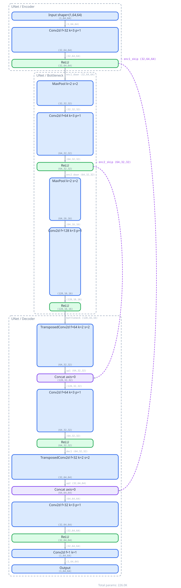

# MLMD — Neural Network Architecture DSL

[](https://github.com/Eeveeboo/machine-learning-markdown/actions/workflows/ci.yml)
[](LICENSE)

MLMD is a DSL (domain-specific language) for describing neural network architectures in a concise, readable format. It compiles `.mlmd` files into multiple representations:

- **SVG diagrams** — standalone architecture visualization
- **PyTorch code** — runnable `nn.Module` subclasses
- **Keras code** — functional API models
- **Candle (Rust) code** — struct + impl for the [Candle](https://github.com/huggingface/candle) framework

The toolchain includes a CLI, a programmatic TypeScript API, a tree-sitter grammar, an LSP server, and editor extensions for VS Code and Zed.

---

## Table of Contents

- [Quick Start](#quick-start)
- [Installation](#installation)
- [CLI Reference](#cli-reference)
- [Configuration](#configuration)
- [Language Guide](#language-guide)
- [Block Reference](#block-reference)
- [Examples](#examples)
- [Editor Support](#editor-support)
- [Plugin System](#plugin-system)
- [LSP Features](#lsp-features)
- [Programmatic API](#programmatic-api)
- [Development](#development)

---

## Quick Start

Create a file `unet.mlmd`:

```mlmd
# U-Net encoder-decoder with skip connections
# Input: 1x64x64 (single-channel image)

[[ UNet ]]

[[ UNet > Encoder ]]

# Encoder level 1: produces skip connection and continues downward
Input(shape=(1,64,64))
    -> Conv2d(filters=32, kernel=3, padding=1) -> ReLU -> [enc1_skip, enc1_down]

[[ UNet > Bottleneck ]]

# Encoder level 2 + bottleneck
[enc1_down] -> MaxPool(kernel=2, stride=2)
            -> Conv2d(filters=64, kernel=3, padding=1) -> ReLU -> [enc2_skip, enc2_down]

[enc2_down]  -> MaxPool(kernel=2, stride=2)
             -> Conv2d(filters=128, kernel=3, padding=1) -> ReLU -> [bottleneck]

[[ UNet > Decoder ]]

# Decoder level 1: upsample bottleneck, merge with enc2 skip
[bottleneck] -> TransposedConv2d(filters=64, kernel=2, stride=2) -> [up1]
[up1, enc2_skip] -> Concat(axis=0)
                 -> Conv2d(filters=64, kernel=3, padding=1) -> ReLU -> [dec1]

# Decoder level 2: upsample, merge with enc1 skip
[dec1]           -> TransposedConv2d(filters=32, kernel=2, stride=2) -> [up2]
[up2, enc1_skip] -> Concat(axis=0)
                 -> Conv2d(filters=32, kernel=3, padding=1) -> ReLU
                 -> Conv2d(filters=1, kernel=1)
                 -> Output

```

| Renders as                |
|---------------------------|
|  |

From the repository root, run:

```bash
# Visualize as SVG
npx tsx bin/mlmd.ts visualize lenet.mlmd -o lenet.svg

# Generate PyTorch code
npx tsx bin/mlmd.ts generate examples/lenet.mlmd -t pytorch -o ./out

# Lint for errors
npx tsx bin/mlmd.ts lint examples/lenet.mlmd
```

After building (see [Installation](#installation)), use the shorter form:

```bash
mlmd visualize lenet.mlmd -o lenet.svg
mlmd generate examples/lenet.mlmd -t pytorch -o ./out
mlmd lint examples/lenet.mlmd
```

---

## Installation

### Prerequisites

- **Node.js** 20+ (uses ES2022 features)
- **npm** 10+

### Clone and Install

```bash
git clone https://github.com/Eeveeboo/machine-learning-markdown.git
cd machine-learning-markdown
npm install
npm run build
```

This compiles the TypeScript source to `dist/` and creates the `mlmd` CLI binary at `dist/bin/mlmd.js`.

### Global install (symlink)

```bash
npm install -g .
mlmd --help
```

Or link locally for development:

```bash
npm link
mlmd --help
```

---

## CLI Reference

### `mlmd --help`

```
Usage: mlmd [options] [command]

CLI for describing and validating neural network architectures.

Options:
  -V, --version          output the version number
  -h, --help             display help for command

Commands:
  visualize [options] <file>    Visualize a .mlmd model architecture as SVG
  generate [options] <file>     Generate code from a .mlmd model
  lint [options] <file>         Lint a .mlmd file for errors and warnings
  lsp [options]                 Start the Language Server Protocol server
  install [options] <command>   Install MLMD editor extensions
  help [command]                display help for command
```

### `mlmd visualize <file>`

Generate an SVG diagram of the architecture.

| Option | Description | Default |
|--------|-------------|---------|
| `-o, --output <file>` | Output SVG file path | stdout |
| `-f, --format <format>` | Output format | `svg` |

```bash
mlmd visualize model.mlmd -o model.svg
mlmd visualize model.mlmd                          # prints SVG to stdout
```

### `mlmd generate <file>`

Generate framework code from a `.mlmd` model file.

| Option | Description | Default |
|--------|-------------|---------|
| `-o, --output <dir>` | Output directory | `.` (or `targets[].out` from `.mlmdrc`) |
| `-t, --target <target>` | Target framework | `pytorch` (or first target from `.mlmdrc`) |

**Targets:** `pytorch`, `keras`, `candle`

```bash
mlmd generate model.mlmd -t pytorch -o ./generated
mlmd generate model.mlmd -t candle -o ./generated
mlmd generate model.mlmd                           # uses defaults from .mlmdrc or pytorch
```

### `mlmd lint <file>`

Lint a `.mlmd` file for errors (shape mismatches, cycles, missing parameters, undefined references).

| Option | Description | Default |
|--------|-------------|---------|
| `--json` | Output diagnostics as JSON | human-readable text |

```bash
mlmd lint model.mlmd
mlmd lint model.mlmd --json                        # machine-readable output
```

### `mlmd lsp`

Start the LSP server on stdin/stdout. Used by editor extensions for diagnostics, hover, autocomplete, and go-to-definition.

```bash
mlmd lsp --stdio
```

### `mlmd install <command>`

Install editor extensions (see [Editor Support](#editor-support)).

```bash
mlmd install vscode                                # install VS Code extension
mlmd install zed                                   # prepare Zed dev extension
```

---

## Configuration

Create a `.mlmdrc` JSON file in your project root for shared defaults:

```json
{
  "plugins": "./mlmd-plugins",
  "targets": [
    { "lang": "pytorch", "out": "./generated" },
    { "lang": "keras", "out": "./generated" },
    { "lang": "candle", "out": "./generated" }
  ]
}
```

| Field | Type | Description |
|-------|------|-------------|
| `plugins` | `string` | Path to a directory of custom block plugins |
| `targets` | `array` | List of default code generation targets |

When no `-t`/`--target` is passed, `mlmd generate` uses the targets from `.mlmdrc`.

---

## Language Guide

### Syntax Overview

| Construct | Example |
|-----------|---------|
| **Block declaration** | `Conv2d(filters=64, kernel=3, padding=1)` |
| **Sequential chain** | `Block1 -> Block2 -> Block3` |
| **Tensor naming (fork)** | `Block -> [tensor_name]` |
| **Tensor joining** | `[tensor_a, tensor_b] -> MergeBlock` |
| **Groups** | `[[ GroupPath > Component ]]` |
| **Comments** | `# single-line comment` |
| **Multi-line chains** | Newline after `->` continues the chain |
| **Multi-line params** | Params span multiple lines inside parentheses |

### Architecture Flow

A `.mlmd` file describes a dataflow graph:

```
Input(shape=(...)) -> [layer after layer] -> Output
```

- Every chain starts from `Input` and ends at `Output`.
- Use `[name]` to name a tensor (fork point).
- Use `[name1, name2]` to join multiple tensors into a merge block.

### Groups

Groups organize architectures hierarchically and map to `nn.Module` subclasses in PyTorch:

```mlmd
[[ Encoder > Block ]]
Input(shape=(3,224,224))
    -> Conv2d(filters=64, kernel=3, padding=1)
    -> [encoder_output]

[[ Decoder > Block ]]
[encoder_output] -> ConvTransposed2d(filters=3, kernel=3)
    -> Output
```

Groups can be nested with `>` separators: `[[ Parent > Child > Grandchild ]]`.

---

## Block Reference (Builtin)

### Layers

| Block | Parameters |
|-------|------------|
| `Input` | `shape=...` |
| `Output` | _(none)_ |
| `Linear` | `in_features`, `out_features`, `bias`(bool) |
| `Embedding` | `num_embeddings`, `embedding_dim` |
| `Conv1d` / `Conv2d` / `Conv3d` | `filters`, `kernel`, `stride`, `padding`, `dilation`, `groups`, `bias`(bool) |
| `TransposedConv2d` | `filters`, `kernel`, `stride`, `padding`, `output_padding`, `bias`(bool) |

### Activations

| Block | Parameters |
|-------|------------|
| `ReLU` | `inplace`(bool) |
| `LeakyReLU` | `negative_slope` |
| `PReLU` | `num_parameters` |
| `ELU` | `alpha` |
| `SELU` | _(none)_ |
| `GELU` | _(none)_ |
| `SiLU` | _(none)_ |
| `Sigmoid` | _(none)_ |
| `Tanh` | _(none)_ |
| `Softmax` | `dim` |

### Normalization

| Block | Parameters |
|-------|------------|
| `BatchNorm` | `features`, `eps`, `momentum`, `affine`(bool) |
| `LayerNorm` | `normalized_shape`, `eps`, `affine`(bool) |
| `GroupNorm` | `num_groups`, `num_channels`, `eps`, `affine`(bool) |
| `InstanceNorm` | `features`, `eps`, `affine`(bool) |

### Pooling

| Block | Parameters |
|-------|------------|
| `MaxPool` | `kernel`, `stride`, `padding`, `dilation`, `ceil_mode`(bool) |
| `AvgPool` | `kernel`, `stride`, `padding`, `ceil_mode`(bool) |
| `GlobalAvgPool` | _(none)_ |
| `AdaptiveAvgPool` | `output_size` |

### Recurrent

| Block | Parameters |
|-------|------------|
| `LSTM` | `input_size`, `hidden_size`, `num_layers`, `bidirectional`(bool), `bias`(bool) |
| `GRU` | `input_size`, `hidden_size`, `num_layers`, `bidirectional`(bool), `bias`(bool) |
| `RNN` | `input_size`, `hidden_size`, `num_layers`, `nonlinearity`, `bidirectional`(bool), `bias`(bool) |

### Transform

| Block | Parameters |
|-------|------------|
| `Flatten` | `start_dim`, `end_dim` |
| `Reshape` | `shape` |
| `Dropout` | `p`, `inplace`(bool) |
| `Pad` | `padding`, `mode` |

### Merge / Arithmetic

| Block | Parameters |
|-------|------------|
| `Add`, `Mul`, `Sub`, `Div` | _(none)_ |
| `Concat` | `axis` |
| `MatMul` | `transpose_a`(bool), `transpose_b`(bool) |

### Control Flow

| Block | Parameters |
|-------|------------|
| `Split` | `sizes` (list of ints), `axis` |
| `Repeat` | `n` |
| `Map` | `block` (block type reference) |
| `Gather` | `axis`, `index` |

---

## Examples

The `examples/` directory contains five complete architectures with generated outputs:

| File | Architecture | Highlights |
|------|-------------|------------|
| [`lenet.mlmd`](examples/lenet.mlmd) | LeNet-5 | Sequential conv → pool → linear pipeline |
| [`resnet-bottleneck.mlmd`](examples/resnet-bottleneck.mlmd) | ResNet Bottleneck | Skip connection with fork/join |
| [`attention.mlmd`](examples/attention.mlmd) | Single-Head Attention | Multi-input: Q, K, V branches |
| [`inception.mlmd`](examples/inception.mlmd) | Inception Module | 4 parallel branches + Concat |
| [`unet.mlmd`](examples/unet.mlmd) | U-Net | Encoder → bottleneck → decoder with skips |

Each `.mlmd` file has corresponding generated outputs:

```
examples/
├── lenet.mlmd           # source
├── lenet.svg            # visualization
├── LeNet5.py            # PyTorch
├── LeNet5.rs            # Candle (Rust)
├── ...                  # (same pattern for all 5 architectures)
```

To regenerate all examples:

```bash
./generate-examples.sh
```

---

## Editor Support

### VS Code

**Option A — Automatic install:**

```bash
# From the repo root (after npm install && npm run build)
mlmd install vscode
```

### Zed

**Prerequisites:** [tree-sitter-cli](https://github.com/tree-sitter/tree-sitter) (for generating the parser)

```bash
npm install -g tree-sitter-cli          # one-time install
mlmd install zed                        # prepare the extension
```

**Features:**
- Syntax highlighting (tree-sitter grammar)
- Bracket matching
- Outline panel
- LSP integration

### Other Editors

MLMD ships with a standard TextMate grammar at [`syntaxes/mlmd.tmLanguage.json`](syntaxes/mlmd.tmLanguage.json), compatible with any editor that supports TextMate grammars (Sublime Text, TextMate, Nova, etc.).

The LSP server (`mlmd lsp`) communicates over stdin/stdout and can be integrated with any editor that supports the Language Server Protocol.

---

## Plugin System

Create custom block types by placing `.mjs` / `.js` / `.ts` files in a plugins directory.

### Plugin Interface

```typescript
// my-custom-block.mjs
export default {
  inputs: ["x"],                          // input tensor names
  outputs: ["y"],                         // output tensor names
  params: {                               // optional: parameter specs
    alpha: { type: "number", default: 0.5 }
  },
  inferShape(inputs, params) {           // input shapes → output shapes
    return [[...inputs[0]]];
  },
  render(ctx) { },                       // custom SVG rendering (optional)
  codegen(ctx) { },                      // custom code generation (optional)
};
```

### Usage

1. Create a plugins directory (e.g., `./mlmd-plugins/`).
2. Point to it in `.mlmdrc`:
   ```json
   { "plugins": "./mlmd-plugins" }
   ```
3. Use the custom block in `.mlmd` files:
   ```mlmd
   MyCustomBlock(alpha=0.3)
   ```

Shape inference, SVG rendering, and code generation all use your plugin.

---

## LSP Features

The MLMD language server provides:

| Feature | Description |
|---------|-------------|
| **Diagnostics** | Real-time lint errors (shape mismatches, cycles, missing params) |
| **Hover** | Type information on hover over blocks and tensors |
| **Autocomplete** | Block type names, parameter names, tensor references |
| **Go-to-Definition** | Jump to block type definitions |
| **Find References** | Locate all tensor usages |

Start the server:

```bash
mlmd lsp --stdio
```

---

## Programmatic API

```typescript
import {
  tokenize,
  parse,
  buildGraph,
  inferShapes,
  getTarget,
  layout,
  render,
  lint,
  loadConfig,
  loadPlugins,
  registerBlock,
  lookupBlock,
  topoSort,
} from "mlmd";
import "mlmd/blocks";                           // register built-in blocks

// Full pipeline
const tokens = tokenize(source);
const { nodes } = parse(tokens);
const graph = buildGraph(nodes);
const result = inferShapes(graph, registry);

// Code generation
const target = getTarget("pytorch");
const files = target.generate(result.graph, registry);

// Visualization
const layoutResult = layout(shapedGraph);
const svg = render(shapedGraph, layoutResult);

// Linting
const diagnostics = lint(graph, registry);

// Custom blocks
registerBlock({
  name: "MyBlock",
  params: [{ name: "alpha", type: "number", default: 0.1 }],
  inferShape(inputs, params) { return [inputs[0]]; },
});
```

---

## Development

### Setup

```bash
git clone https://github.com/Eeveeboo/machine-learning-markdown.git
cd machine-learning-markdown
npm install
```

### Scripts

| Command | Description |
|---------|-------------|
| `npm run build` | Compile TypeScript with `tsup` (outputs to `dist/`) |
| `npm test` | Run all tests with Vitest |
| `npm run typecheck` | Type-check all source files with `tsc --noEmit` |
| `npm run dev` | Watch mode — rebuild on file changes |

### Project Structure

```
├── src/                   # TypeScript source
│   ├── ast/               # AST node types & graph IR
│   ├── blocks/            # Block registry & type definitions
│   ├── cli/               # Commander CLI setup + commands
│   ├── codegen/           # Code generation backends (pytorch, keras, candle)
│   ├── config/            # .mlmdrc config loader
│   ├── lint/              # Lint rules & orchestrator
│   ├── lsp/               # LSP server
│   ├── parser/            # Tokenizer, parser, graph builder
│   ├── plugins/           # Plugin system & built-in blocks (43 blocks)
│   ├── shape/             # Shape inference engine
│   ├── visualize/         # Layout + SVG rendering
│   └── index.ts           # Public API barrel exports
├── bin/mlmd.ts            # CLI entry point
├── grammars/mlmd/         # Tree-sitter grammar package
├── syntaxes/              # TextMate grammar for syntax highlighting
├── languages/mlmd/        # Editor configs (VS Code, legacy Zed)
├── mlmd-vscode/           # VS Code extension
├── zed-mlmd/              # Zed editor extension
├── examples/              # Example .mlmd files + generated outputs
└── tests/                 # Test suite (27 test files, 298+ tests)
```

### Testing

```bash
npm test                              # run all tests
npx vitest run                         # same as above
npx vitest run tests/lint/lint.test.ts   # single test file
npx vitest --watch                     # watch mode
```

### Building the Tree-Sitter Grammar

```bash
cd grammars/mlmd
npm install
npm exec tree-sitter generate
```

### Regenerating Example Outputs

```bash
./generate-examples.sh
```

---
